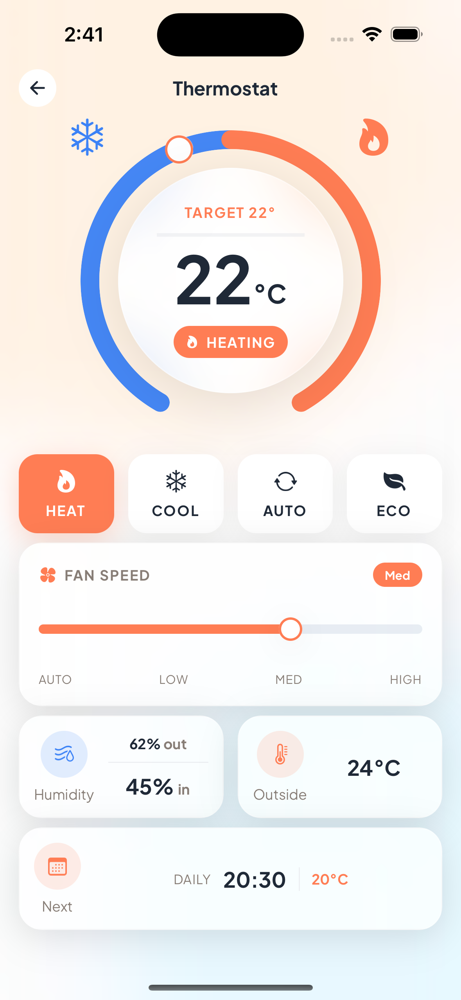

# Lumina Smart

[](https://opensource.org/licenses/MIT)

A smart home concept app built with React Native + Expo — a personal hobby project exploring advanced mobile UI patterns, custom animation systems, and component architecture.

<p align="center">
  
  
  
</p>

---

## Tech Stack

- **React Native + Expo** — Expo Router with file-based routing
- **TypeScript** — strict throughout
- **Zustand** — lightweight global state (`useDeviceStore`, `useConnectionStore`)
- **React Native Reanimated + Gesture Handler** — animations and gesture interactions
- **React Native SVG** — circular sliders and colour pickers (no third-party UI libs)
- **expo-av / expo-audio** — music playback with silent-mode support
- **expo-haptics** — tactile feedback (tap, press, success, etc.)
- **expo-linear-gradient + expo-symbols** — gradients and SF Symbols (iOS)
- **Neumorphic / glassmorphic design system** — custom theme tokens (light & dark)

---

## Architecture Highlights

- **File-based routing** via Expo Router (`app/(tabs)/`, `app/device/[id]`)
- **Custom design system** — `surface`, `accent`, `text`, `icon`, `shadowDark`, `shadowLight` and status colours; consistent light/dark mode
- **Per-device-type detail screens** in `src/features/device-detail/`:
  - **Light** — brightness, colour temp, colour palette
  - **Thermostat** — circular dial, schedule, modes
  - **Lock** — main door (green) / bedroom (orange) hero card, digital keys, access rules, AC protection; auto lock/unlock from time windows
  - **Camera** — live feed; carousel on Hub with priority loading, sequential tour, and preloading
  - **Doorbell** — live feed, event list with swipe-to-delete
  - **Solar** — generation status and flow viz
  - **Vacuum** — floor map, return to dock, suction levels, mode selector
  - **Purifier** — AQI gauge and pollutant display
  - **Sprinkler** — zones and scheduling
- **Fully custom SVG components** — thermostat dial, colour temperature slider, colour picker
- **Camera carousel (Hub)** — priority image loading, 3.5s tour per slide, preload next slides, optimized assets
- **Music player** — expo-av with progress bar, track advance and loop, plays in silent mode, 500ms standby delay
- **Haptic feedback** — shared `haptics` utility (tap, press, success, etc.) used across controls and navigation

---

## Screens

| Screen | Description |
|--------|-------------|
| **Hub** | Dashboard with scene modes (Morning, Away, Work, Movie, Sleep), live camera carousel, categorised device grid, music player card, weather/energy pills |
| **Device Detail** | Per-type controls — brightness/colour, thermostat dial, lock hero + keys + rules, camera feed, doorbell events, solar flow, vacuum map, purifier AQI, sprinkler zones |
| **Usage** | Energy and usage analytics |
| **Flows** | Automation flows |
| **Settings** | App settings |

---

## Getting Started

```bash
npm install
npx expo start
```

> **iOS recommended** — uses SF Symbols via `expo-symbols`. Android falls back to Material Icons.  
> **Mock data only** — no backend or real device integration.

---

## License

MIT — see [LICENSE](LICENSE) for details.
